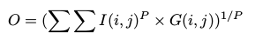

# Homework1

Baseline: softmax, l2 regularization acc = 97.0%

- #### Q1: Finding alternatives of softmax

  

|formular|result|
|:---:|:---:|
|abs-max|failed
|square-max|failed
|plus-one-abs-max|failed
|non-negative-max|acc=96.0%

- #### Q2: Regression vs Classification 
  - Change cross entropy loss to the square of euclidean distance between model predicted probability and one hot vector of the true label.
   * acc= 97.2%

- #### Q3: Lp pooling 
  - Change all pooling layers to [Lp pooling](https://www.computer.org/csdl/proceedings/icpr/2012/2216/00/06460867.pdf)
   
   
  
     * acc=92.3%(p=4)
- #### Q4: Regularization
  - Try Lp regularization with different p. 
  - Set Lp regularization to a minus number. 

|p-value|result|
|:---:|:---: |
| p=1 | acc=96.9%
| p=-2 | acc=96.6%

# Homework_1a

- #### Q1: How a smaller dataset affects test accuracy?
  - a. Feed all the data from train32x32.mat.
  - b. Feed 30000 images from train32x32.mat.
  - c. Feed 10000 images from train32x32.mat.

|dataset size| result|
|:---:|:---:|
|73527|0.945|
|30000|0.928|
|10000|0.896|

- #### Q2: How the distribution of data affects test accuracy?
   - Reduce the size of training data in the following ways, 
     - reduce the amount of images labelled with'8' '9' and '0' to 500 and get Dataset A

         cnt = [500, 13861, 10585, 8497, 7458, 6882, 5727, 5595, 500, 500]
     
     - reduce the amount of images labelled with '6', '7', '8','9' and '0' to 1000 and get Dataset B

        cnt = [1000, 13861, 10585, 8497, 7458, 6882, 1000, 1000, 1000, 1000]
     
     - reduce the amount of images labelled with '1','2','3','4'and '5' to 6000 and get Dataset C

        cnt = [4948, 6000, 6000, 6000, 6000, 6000, 5727, 5595, 5045, 4659]
  
 - Rerun the classification task with Dataset A, Dataset B and Dataset C respectively.

|dataset size| result|
|:---:|:---:|
|(Q1.a)73257|0.945
|A-60105|0.913|
|B-55974|0.921|
|C-55974|**0.936**|

- Rerun the classification task with 30000 images from Dataset A,  Dataset B and Dataset C respectively.

|dataset size| result|
|:---:|:---:|
|(Q1.b)30000|0.928
|A-30000|0.903|
|B-30000|0.905|
|C-30000|**0.928**|

 - Rerun the classification task with 10000 images from Dataset A,  Dataset B and Dataset C respectively.

|dataset size| result|
|:---:|:---:|
|(Q1.c)10000|0.896
|A-10000|0.862|
|B-10000|0.905|
|C-10000|**0.896**|

- #### Q3: How augmentation helps when training dataset is small?
|augmentation|dataset size| result
|:---:|:---:|:---: |
|none |73257|0.945|
|none |30000|0.928
|none |10000|0.896
|color inversion|73257|0.943
||30000|0.928
||10000|0.903|
|affine|73527|**0.954**|
||30000|**0.942**|
||10000|**0.911**|
|salt and pepper|73257|0.934|
||30000|0.911
||10000|0.860

- #### Q4: Whether [_Mixup_]((https://arxiv.org/abs/1710.09412))(a data-agnostic augmentation technique) helps
|dataset size|result
|:---:|:---:|
|(Q1.a)73257|0.945|
|(Q1.b)30000|0.928
|(Q1.c)10000|0.896
|(mixup)73257|0.942
|(mixup)30000|0.924
|(mixup)10000|0.900

## Tips
- minibatch size
- augmentation
- control experiment
